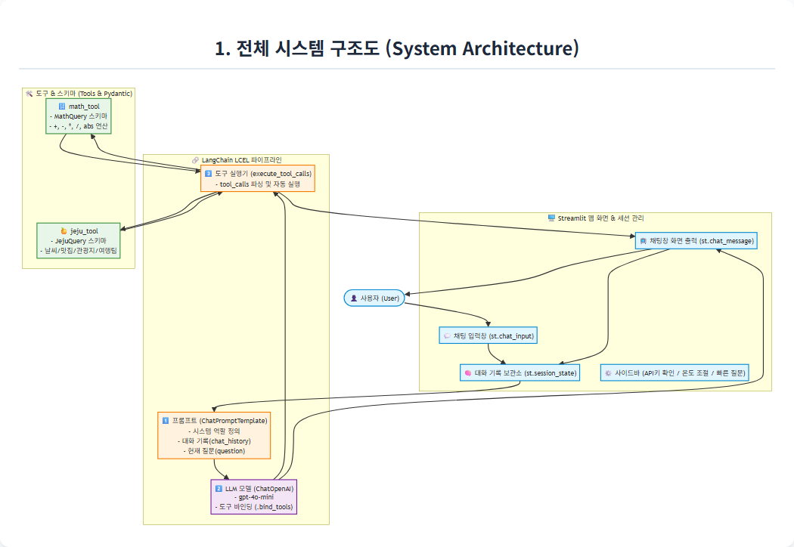
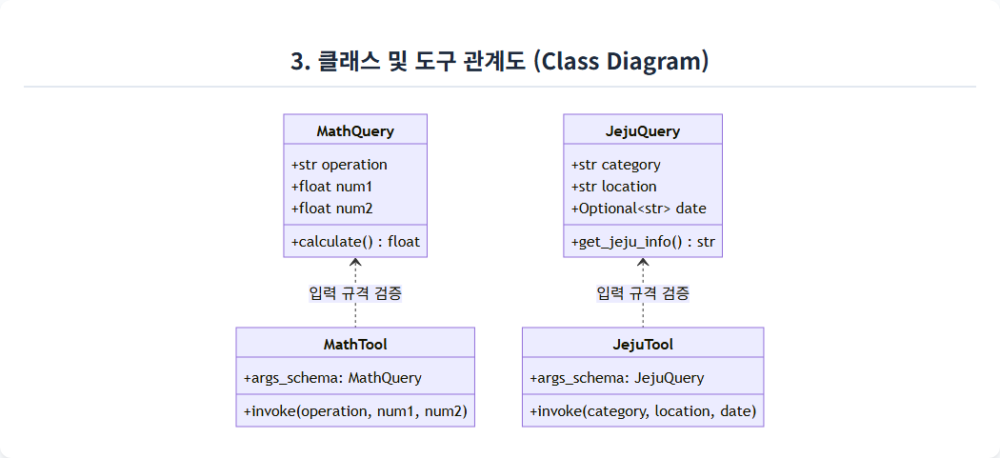
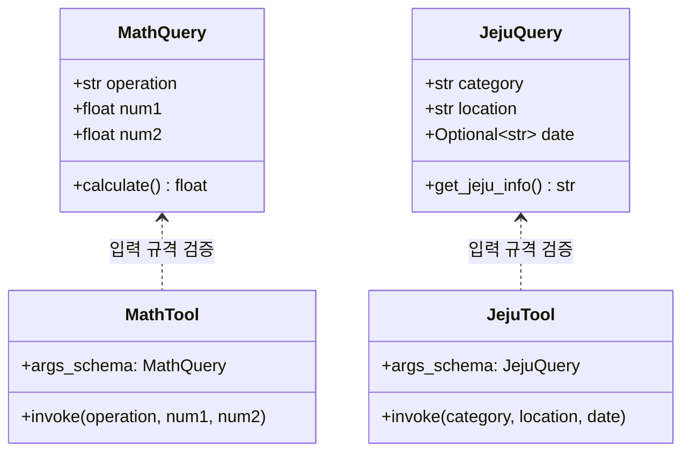

# 🏝️ mymathjeju.py 완전 정복 가이드 (초보자용 구조도)

이 문서는 **`mymathjeju.py`**의 작동 원리와 구조를 초보자도 쉽게 이해할 수 있도록 **Mermaid 다이어그램**과 단계별 해설로 정리한 가이드입니다.

---

## 📌 1. 전체 시스템 구조 한눈에 보기



사용자가 웹 화면(Streamlit)에서 질문을 입력했을 때, 시스템 내부에서 어떤 순서로 처리되는지 보여주는 전체 구조도입니다.


```mermaid
graph TD
    %% 스타일 정의
    classDef ui fill:#E1F5FE,stroke:#0288D1,stroke-width:2px;
    classDef lcel fill:#FFF3E0,stroke:#F57C00,stroke-width:2px;
    classDef tool fill:#E8F5E9,stroke:#388E3C,stroke-width:2px;
    classDef model fill:#F3E5F5,stroke:#7B1FA2,stroke-width:2px;

    User(["👤 사용자 (User)"]):::ui
    
    subgraph Streamlit_UI ["🖥️ Streamlit 웹 화면 & 세션 관리"]
        ChatInput["💬 채팅 입력창 (st.chat_input)"]:::ui
        SessionState["🧠 대화 기록 보관소 (st.session_state)"]:::ui
        Sidebar["⚙️ 사이드바 (API키 확인 / 온도 조절 / 빠른 질문)"]:::ui
        ChatDisplay["📺 채팅창 화면 출력 (st.chat_message)"]:::ui
    end

    subgraph LCEL_Chain ["🔗 LangChain LCEL 파이프라인"]
        Prompt["1️⃣ 프롬프트 (ChatPromptTemplate)<br/>- 시스템 역할 정의<br/>- 대화 기록(chat_history)<br/>- 현재 질문(question)"]:::lcel
        ModelWithTools["2️⃣ LLM 모델 (ChatOpenAI)<br/>- gpt-4o-mini<br/>- 도구 바인딩 (.bind_tools)"]:::model
        ExecuteTool["3️⃣ 도구 실행기 (execute_tool_calls)<br/>- tool_calls 파싱 및 자동 실행"]:::lcel
    end

    subgraph Tools_Layer ["🛠️ 도구 & 스키마 (Tools & Pydantic)"]
        MathTool["🔢 math_tool<br/>- MathQuery 스키마<br/>- +, -, *, /, abs 연산"]:::tool
        JejuTool["🍊 jeju_tool<br/>- JejuQuery 스키마<br/>- 날씨/맛집/관광지/여행팁"]:::tool
    end

    %% 연결 관계
    User -->|질문 입력 / 버튼 클릭| ChatInput
    ChatInput -->|질문 저장| SessionState
    SessionState -->|대화 기록 전달| Prompt
    Prompt --> ModelWithTools
    
    ModelWithTools -->|도구 호출 필요 시 (tool_calls)| ExecuteTool
    ExecuteTool -->|수학 계산 요청| MathTool
    ExecuteTool -->|제주 정보 요청| JejuTool
    
    MathTool -->|계산 결과| ExecuteTool
    JejuTool -->|안내 정보| ExecuteTool
    
    ExecuteTool -->|최종 결과 문자열| ChatDisplay
    ModelWithTools -->|일반 대화인 경우| ChatDisplay
    ChatDisplay -->|화면 표시 및 세션 저장| SessionState
    ChatDisplay -->|답변 확인| User
```

---

## 🔄 2. 질문 처리 및 도구 호출 흐름도 (시퀀스)


사용자가 질문을 했을 때 시스템이 어떻게 **"도구가 필요한지 판단"**하고 실행하는지 보여줍니다.


```mermaid
flowchart TD
    Start(["🚀 사용자 질문 입력"]) --> SaveUserMsg["1. 사용자 메시지를 세션(messages)에 저장 및 화면 표시"]
    SaveUserMsg --> MakeHistory["2. 이전 대화 기록을 LangChain 메시지(Human/AI)로 변환"]
    MakeHistory --> RunChain["3. LCEL 체인 실행 (invoke)"]
    
    RunChain --> LLMDecision{"4. LLM 모델의 판단<br/>(도구 호출이 필요한가?)"}
    
    %% 분기 1: 도구 호출이 필요 없는 경우
    LLMDecision -->|아니오 (일반 대화)| NormalResponse["💬 LLM 일반 텍스트 답변 생성"]
    NormalResponse --> ShowOutput["5. 화면에 답변 출력 & 세션에 저장"]
    
    %% 분기 2: 도구 호출이 필요한 경우
    LLMDecision -->|예 (도구 필요)| HasToolCalls["🛠️ tool_calls 생성 (도구명 & 파라미터 JSON)"]
    
    HasToolCalls --> CheckToolType{"어떤 도구인가?"}
    
    CheckToolType -->|math_tool| MathExec["🔢 MathQuery 스키마 검증 및 calculate() 실행<br/>예: abs(2 - 17) ➡️ 15"]
    CheckToolType -->|jeju_tool| JejuExec["🍊 JejuQuery 스키마 검증 및 get_jeju_info() 실행<br/>예: 제주 서귀포 날씨 ➡️ 맑음, 22°C"]
    
    MathExec --> FormatResult["결과 문자열 포맷팅<br/>'✅ [math_tool 호출 성공] ...'"]
    JejuExec --> FormatResult
    
    FormatResult --> ShowOutput
    ShowOutput --> End(["🏁 대기 상태 (다음 질문 대기)"])

    %% 스타일 적용
    style Start fill:#4CAF50,stroke:#388E3C,color:#fff
    style End fill:#607D8B,stroke:#455A64,color:#fff
    style LLMDecision fill:#FFF9C4,stroke:#FBC02D,stroke-width:2px
    style CheckToolType fill:#FFE0B2,stroke:#FB8C00,stroke-width:2px
    style MathExec fill:#E8F5E9,stroke:#4CAF50
    style JejuExec fill:#E0F2F1,stroke:#009688
```

---

## 🧩 3. 핵심 구성 요소 4단계 분해

### 1️⃣ 입력 스키마 정의 (`Pydantic BaseModel`)
* **역할**: LLM이 넘겨주는 파라미터의 데이터 타입과 형식을 엄격하게 검증합니다.
* **클래스 구성**:
  * `MathQuery`: `operation`(연산자), `num1`(첫번째 숫자), `num2`(두번째 숫자) 검증 및 `calculate()` 연산 로직 내장
  * `JejuQuery`: `category`(날씨/맛집/관광지/팁), `location`(지역), `date`(날짜) 검증 및 `get_jeju_info()` 정보 생성 로직 내장






---

### 2️⃣ 툴 데코레이터 (`@tool`)
* 일반 파이썬 함수에 `@tool(args_schema=...)`를 붙여 LangChain이 인식할 수 있는 도구 객체로 변환합니다.
* LLM은 이 함수의 `Docstring`(설명문)과 스키마 설명을 읽고 **어떤 상황에 이 도구를 써야 할지 스스로 판단**합니다.

---

### 3️⃣ LCEL 파이프라인 (`prompt | model_with_tools | execute_tool_calls`)
LangChain의 파이프 연산자(`|`)를 통해 데이터를 물 흐르듯 전달합니다:

| 단계 | 구성 요소 | 수행하는 작업 |
| :--- | :--- | :--- |
| **1단계** | `prompt` | 시스템 지침 + 대화 기록 + 사용자 질문을 하나로 조립 |
| **2단계** | `model.bind_tools(tools)` | LLM에게 사용 가능한 도구 목록(`math_tool`, `jeju_tool`)을 알려주고 실행 권한 부여 |
| **3단계** | `execute_tool_calls` | LLM이 도구 호출을 결정하면 해당 파이썬 함수를 실제로 실행하고 결과를 보기 좋게 포맷 |

---

### 4️⃣ Streamlit UI & 세션 상태 (`st.session_state`)
* 웹 화면이 새로고침(Rerun)되어도 이전 대화가 날아가지 않도록 `st.session_state["messages"]`에 대화 목록을 영구 저장합니다.
* 사이드바를 통해 API 연결 상태, 창의성(Temperature) 조절, 대화 초기화 버튼, 빠른 질문 버튼을 제공합니다.

---

## 💡 초보자를 위한 핵심 문답 (FAQ)

> **Q. LLM 모델이 직접 수학 계산을 안 하고 왜 도구를 호출하나요?**  
> **A.** LLM은 언어 모델(확률적 텍스트 생성기)이기 때문에 `abs(2 - 17)` 같은 연산이나 복잡한 계산에서 환각(오답)을 낼 수 있습니다. 따라서 계산 전용 파이썬 함수(`math_tool`)에 맡겨 **100% 정확한 결과**를 얻기 위함입니다.

> **Q. `bind_tools`는 무슨 역할을 하나요?**  
> **A.** LLM에게 *"너는 필요할 때 `math_tool`과 `jeju_tool`이라는 도구를 골라서 쓸 수 있어"* 하고 도구 설명서(도구 이름, 파라미터 규격)를 쥐어주는 역할을 합니다.

> **Q. LCEL(`|`)의 장점은 무엇인가요?**  
> **A.** 코드가 직관적이며 프롬프트 생성 ➡️ 모델 추론 ➡️ 도구 실행 과정이 하나의 파이프라인으로 깔끔하게 연결되어 유지보수와 디버깅이 매우 쉬워집니다.
