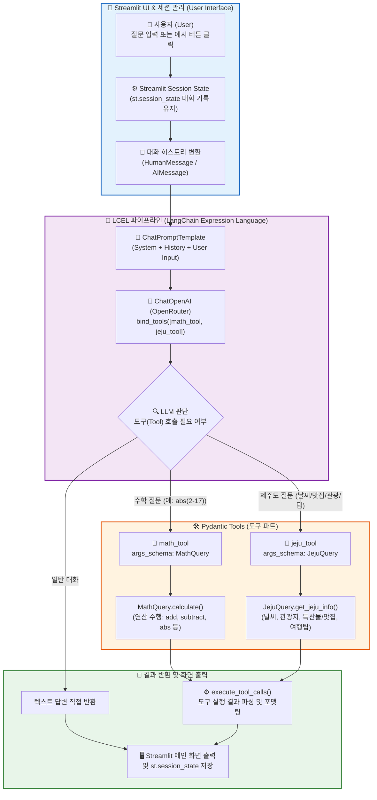
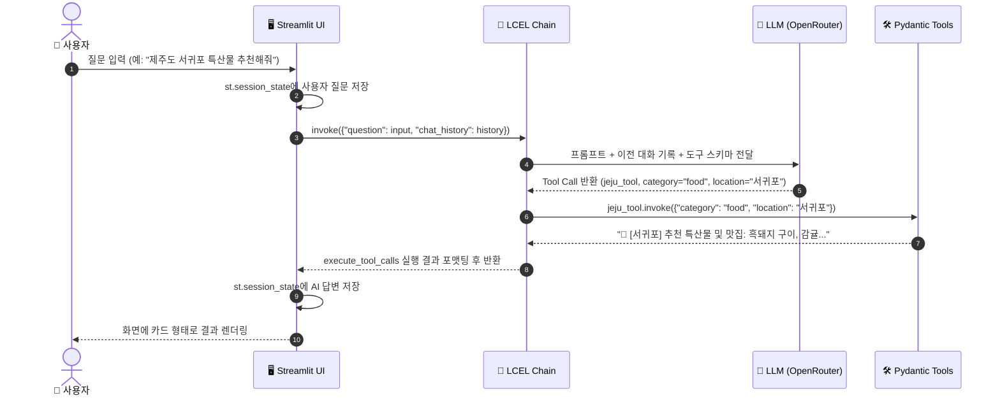

# 🍊 mymathjeju.py 파이프라인 구조도 및 코드 설명서 (Beginner's Guide)

이 문서는 `mymathjeju.py`의 전체적인 작동 원리와 파이프라인 구조를 초보자도 쉽게 이해할 수 있도록 **Mermaid 다이어그램**과 핵심 구성요소별 설명으로 정리한 아키텍처 가이드입니다.

---

## 💡 1. 한눈에 보는 전체 시스템 구조도 (System Architecture)

`mymathjeju.py`는 **Streamlit 대화형 UI**, **LangChain LCEL 파이프라인**, **Pydantic 스키마 기반 Tool (수학 연산 & 제주도 가이드)**, **OpenRouter API**가 결합되어 동작하는 스마트 멀티턴 어시스턴트입니다.



---

## 🧩 2. 핵심 구성 요소별 역할 설명 (Core Components)

### 1️⃣ Pydantic 입력 스키마 (`MathQuery`, `JejuQuery`)
* **역할**: AI 모델이 도구를 호출할 때 전달하는 인자(Arguments)의 유효성을 검증하고 기본 비즈니스 로직을 수행합니다.
* **주요 클래스**:
  * `MathQuery`: `operation` (연산자: `add`, `subtract`, `multiply`, `divide`, `abs` 및 `+`, `-`, `*`, `/`, `더하기`, `절댓값`), `num1`, `num2` 데이터를 검증하고 `calculate()` 메서드로 실제 수식을 계산합니다.
  * `JejuQuery`: `category` (`weather`, `tourist_spot`, `food`, `tip` 및 한글 명칭), `location` (지역), `date` (날짜)를 검증하고 `get_jeju_info()` 메서드로 맞춤 가이드 정보를 반환합니다.

### 2️⃣ LangChain Tool 데코레이터 (`@tool(args_schema=...)`)
* **역할**: 일반 파이썬 함수를 LangChain과 OpenAI 도구 호출 표준 규격에 맞게 변환합니다.
* **특징**: `args_schema`에 Pydantic 클래스를 지정하여 모델이 인자 타입과 설명을 정확하게 인지하도록 돕습니다.

### 3️⃣ OpenRouter API & LLM Tool Binding (`bind_tools`)
* **역할**: OpenRouter를 통해 `openai/gpt-4o-mini` 모델을 로드하고, `bind_tools([math_tool, jeju_tool])`를 통해 도구 목록을 모델에 전달합니다.
* **작동**: 사용자의 질문에 도구가 필요하면 AI는 직접 답변하지 않고 `tool_calls`를 생성하여 반환합니다.

### 4️⃣ LCEL 파이프라인 (`lcel_chain`)
* **체인 구조**: `prompt | model_with_tools | execute_tool_calls`
* **순서**:
  1. `prompt`: 시스템 프롬프트 + 이전 대화 기록(`chat_history`) + 현재 질문(`question`)을 조립합니다.
  2. `model_with_tools`: 도구가 바인딩된 LLM이 질문을 분석하고 텍스트 응답 또는 Tool Call을 결정합니다.
  3. `execute_tool_calls`: Tool Call이 있으면 해당 도구를 실행하고 결과를 가공하며, 없으면 텍스트 답변을 그대로 반환합니다.

### 5️⃣ Streamlit 대화형 UI & 세션 관리 (`st.session_state`)
* **사이드바**:
  * OpenRouter API 키 연결 상태 표시
  * 대화 기록 초기화 (`Clear Session`) 버튼
  * Temperature (창의성/정확도) 조절 슬라이더
  * 빠른 질문 예시 버튼 (날씨, 맛집, 수학 계산)
* **메인 대화창**:
  * `st.session_state["messages"]`를 통해 페이지 새로고침 시에도 이전 대화 맥락 유지
  * `st.chat_input` 및 `st.chat_message`를 통한 직관적인 채팅 인터페이스 제공

---

## 🔄 3. 데이터 흐름 순서도 (Data Execution Sequence)



---

## 🚀 4. 실행 방법 (How to Run)

터미널에서 가상환경(`.venv`)이 활성화된 상태로 다음 명령어를 실행합니다:

```bash
streamlit run mymathjeju.py
```
